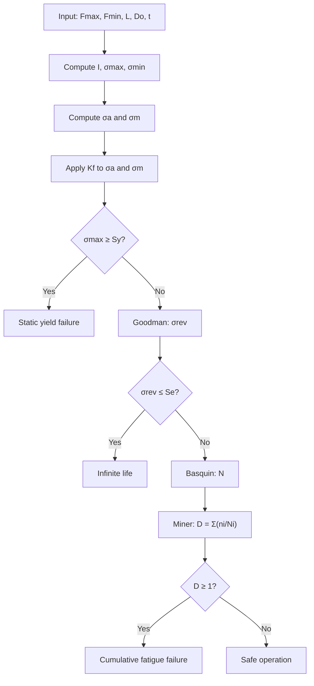

# Fatigue Simulator for Butt-Welded Tubular Joints

Fatigue life simulator for two butt-welded steel tubes under cyclic bending load, developed as the final project for *Temas Selectos de Ingeniería Mecánica II* (Facultad de Ingeniería, UNAM).

*Simulador de vida a fatiga para dos tubos de acero soldados a tope bajo carga cíclica a flexión, desarrollado como proyecto final de la asignatura Temas Selectos de Ingeniería Mecánica II (Facultad de Ingeniería, UNAM).*

---

## Key finding / Hallazgo principal

At the nominal load of 25 kN the joint reaches an equivalent fully-reversed stress of **94.84 MPa** against a corrected endurance limit of **94.75 MPa**, giving a Goodman safety factor of **0.999**. The test bench operates essentially **on the fatigue limit of the welded joint**, with no design margin.

*Con la carga nominal de 25 kN la junta alcanza un esfuerzo equivalente completamente invertido de 94.84 MPa frente a un límite de fatiga corregido de 94.75 MPa, lo que da un factor de seguridad de Goodman de 0.999. El banco de pruebas opera prácticamente sobre el límite de fatiga de la junta soldada, sin margen de diseño.*

---

## Case study / Caso de estudio

| Parameter / Parámetro | Value / Valor |
|---|---|
| Section / Perfil | Round HSS, D_o = 114.3 mm, t = 6.35 mm |
| Material | ASTM A500 Gr. B — S_ut = 400 MPa, S_y = 290 MPa |
| Span / Claro | L = 1200 mm |
| Load / Carga | F_min = 2.5 kN, F_max = 25 kN (R = 0.1) |
| Corrected endurance limit / Límite de fatiga corregido | S_e = 94.75 MPa |
| Weld stress-concentration factor / Factor de concentración | K_f = 1.2 |

Geometry and material properties are **design assumptions**, stated as such in the report.

*La geometría y las propiedades del material son supuestos de diseño, declarados como tales en el reporte.*

---

## Methodology / Metodología

Nominal-stress approach with a fatigue stress-concentration factor (Shigley), **not** IIW/Eurocode 3 FAT detail categories. `K_f` multiplies the operating stresses instead of reducing `S_e`, so the mean-stress concentration at the weld toe is not omitted and the penalty is not applied twice.

*Enfoque de esfuerzo nominal con factor de concentración por fatiga (Shigley), no categorías FAT del IIW ni del Eurocódigo 3. K_f multiplica los esfuerzos operativos en lugar de reducir S_e, de modo que la concentración sobre el esfuerzo medio no se omite y la penalización no se aplica dos veces.*



---

## Results / Resultados

| Quantity / Magnitud | Value / Valor |
|---|---|
| Life at 25 kN / Vida a 25 kN | 9.95 × 10⁵ cycles |
| Life at 45 kN / Vida a 45 kN | 1.21 × 10⁴ cycles |
| Static failure above / Falla estática por encima de | ≈ 53 kN |
| Miner damage, sample spectrum / Daño de Miner, espectro de muestra | D = 0.844 |

Sample spectrum: 500 000 cycles at 20 kN, 300 000 at 25 kN, 50 000 at 35 kN. The 35 kN block contributes 64% of the damage in 6% of the applied cycles.

*Espectro de muestra: 500 000 ciclos a 20 kN, 300 000 a 25 kN y 50 000 a 35 kN. El bloque de 35 kN aporta el 64% del daño en el 6% de los ciclos aplicados.*

### Critical boundaries / Valores críticos

Located by bisection on the condition σ_rev = S_e:

*Localizados por bisección sobre la condición σ_rev = S_e:*

| Parameter / Parámetro | Critical / Crítico | Design / Diseño | Margin / Margen |
|---|---|---|---|
| Maximum load / Carga máxima | 24.98 kN | 25 kN | 0.07% |
| Wall thickness / Espesor de pared | 6.3556 mm | 6.35 mm | 0.09% |
| Span / Claro | 1199.13 mm | 1200 mm | 0.07% |

These are not three independent findings: they are a single condition seen from three variables.

*No son tres hallazgos independientes: son una única condición vista desde tres variables.*

---

## Repository structure / Estructura del repositorio

```
src/      Simulator module and plotting scripts
data/     Generated figures (PNG)
docs/     Report, flowchart source and rendered diagram
app/      Reserved for the interactive web interface (future work)
notebooks/ Reserved for the synthetic dataset and ML model (future work)
tests/    Reserved for unit tests (future work)
```

`app/`, `notebooks/` and `tests/` are intentionally empty. They correspond to the extensions listed under Future work below, planned but not part of the course deliverable.

*`app/`, `notebooks/` y `tests/` están intencionalmente vacías. Corresponden a las extensiones listadas en Trabajo futuro, planeadas pero fuera del entregable de la asignatura.*

### `src/fatigue.py`

Simulation model. Twelve independent functions, each documented with a bilingual docstring:

`alternating_stress` · `mean_stress` · `moment_of_inertia` · `max_bending_moment` · `bending_stress` · `goodman_equivalent_stress` · `goodman_safety_factor` · `basquin_constants` · `fatigue_life` · `life_for_force` · `miner_damage` · `damage_history` · `blocks_until_failure`

### Plotting scripts / Scripts de graficación

| Script | Output |
|---|---|
| `plot_sn_curve.py` | `data/sn_curve.png` |
| `plot_goodman.py` | `data/goodman_diagram.png`, `data/goodman_detail.png` |
| `plot_damage.py` | `data/damage_accumulation.png` |
| `plot_sensitivity.py` | `data/sensitivity_load.png`, `_thickness.png`, `_span.png` |

All scripts import from `fatigue.py` and never reimplement the calculation chain, so the model has a single source of truth.

*Todos los scripts importan de `fatigue.py` y no reimplementan la cadena de cálculo, de modo que el modelo tiene una única fuente de verdad.*

---

## Requirements and usage / Requisitos y uso

Python 3.14. The only external dependency is matplotlib; the calculation itself relies solely on the standard library (`math`).

*Python 3.14. La única dependencia externa es matplotlib; el cálculo se apoya exclusivamente en la biblioteca estándar (`math`).*

```bash
pip install -r requirements.txt
```

Run from the repository root, so the relative paths to `data/` resolve correctly:

*Ejecutar desde la raíz del repositorio, para que las rutas relativas a `data/` se resuelvan correctamente:*

```bash
python src/fatigue.py          # model self-test / autoprueba del modelo
python src/plot_sn_curve.py
python src/plot_goodman.py
python src/plot_damage.py
python src/plot_sensitivity.py
```

---

## Limitations / Limitaciones

- **Palmgren-Miner ignores load sequence.** The predicted damage is the same regardless of whether severe blocks are applied first or last.
- **Goodman validity domain.** Equation (6) only holds while σ_m < S_ut; this is guaranteed by the static yield check that precedes it.
- **Critical fibre only.** Only the outer fibre in tension is evaluated. The compressive branch is implemented for generality but is not activated by this load case.
- **Loads below the endurance limit are treated as non-damaging**, which is debatable for welded joints.
- **Fixed material and geometry.** Properties are module-level constants; analysing a different steel or weld detail requires editing the code.

*La regla de Miner ignora el orden de aplicación; Goodman solo es válido mientras σ_m < S_ut; se evalúa únicamente la fibra en tracción; las cargas bajo el límite de fatiga se tratan como inocuas; el material y la geometría están fijos como constantes del módulo.*

---

## Future work / Trabajo futuro

- Experimental validation of the physical test bench
- Synthetic dataset generation and a regression model to predict fatigue life
- Web interface for interactive parameter exploration
- Unit test suite for the model functions

*Validación experimental del banco físico; generación de un conjunto de datos sintético y un modelo de regresión que prediga la vida a fatiga; interfaz web para exploración interactiva de parámetros; batería de pruebas unitarias para las funciones del modelo.*

---

## References / Referencias

Budynas, R. G., y Nisbett, J. K. (2012). *Diseño en ingeniería mecánica de Shigley* (9a ed.). McGraw-Hill.

Instituto Técnico de la Estructura en Acero. (s.f.). *Diseño para fatiga* (Tomo 14). ESDEP.

---

## Author / Autor

Edgar Demian Martínez Balbuena — Facultad de Ingeniería, UNAM
